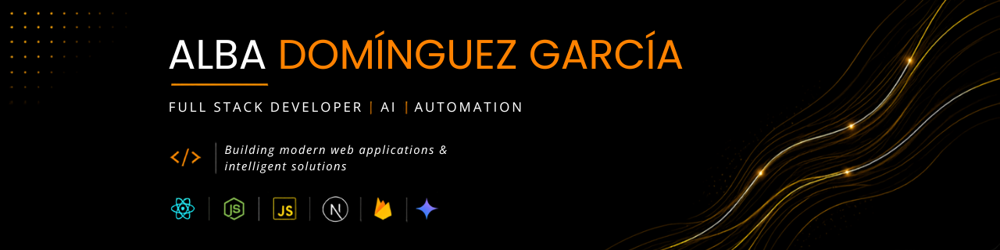

  

# Hi, I'm Alba! 👋

## About Me

I'm a Full Stack Developer passionate about building AI-powered applications, automation platforms and scalable software solutions.

I enjoy combining modern web technologies with Artificial Intelligence to automate complex workflows, optimize business processes and solve real-world problems.

Recently, I developed a production automation platform for Televisión de Galicia (TVG), automating YouTube publishing, SEO content generation and image creation through AI-assisted workflows. I'm currently expanding my expertise in Artificial Intelligence and software architecture while continuing to build my skills as a Full Stack Developer.

## 💻 Tech Stack

### Frontend

### Backend

### Database & ORM

### Tools

### Authentication

### Deployment

---

## 🚀Featured Projects:

## 🎥 TVG Automation Platform

Professional automation platform developed for Televisión de Galicia (TVG).

**Key features**

- Automatic SEO generation
- Image generation
- YouTube publishing
- PDF processing
- Workflow automation

**Stack**

Node.js • React • TypeScript • MongoDB • Docker

---

## 🤖 AtmanSys Lead Intelligence

AI-powered internal platform developed to automate the discovery, analysis and qualification of potential clients for AtmanSys.

**Key features**

- AI-powered lead discovery
- Business opportunity analysis
- Operational bottleneck detection
- Personalized software recommendations
- Built-in CRM
- AI-generated commercial proposals

**Stack**

HTML5 • CSS3 • JavaScript • Google Gemini API • PWA • Service Workers • Vercel

---

## 🧠 TDAH App

Application focused on helping people with ADHD improve organization and productivity.

---

## 🌐 AtmanSys WebPage

Corporate website for AtmanSys, showcasing software development, automation solutions and technical services

---

## 🌱Current Focus:

- Building scalable Full Stack applications
- Artificial Intelligence
- Software Architecture
- Automation Platforms

## 📫 Contact:

📧 albadege94@gmail.com 

💼 [LinkedIn](https://www.linkedin.com/in/albadominguezgarcia)
